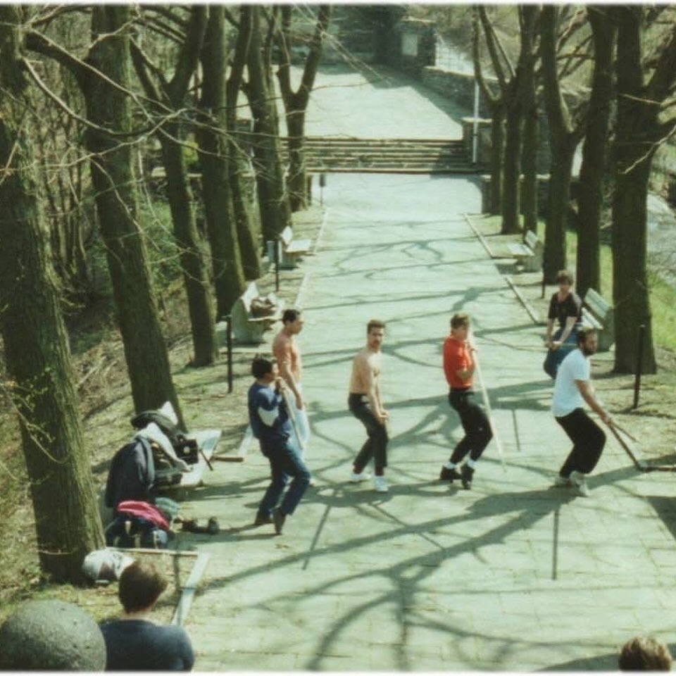
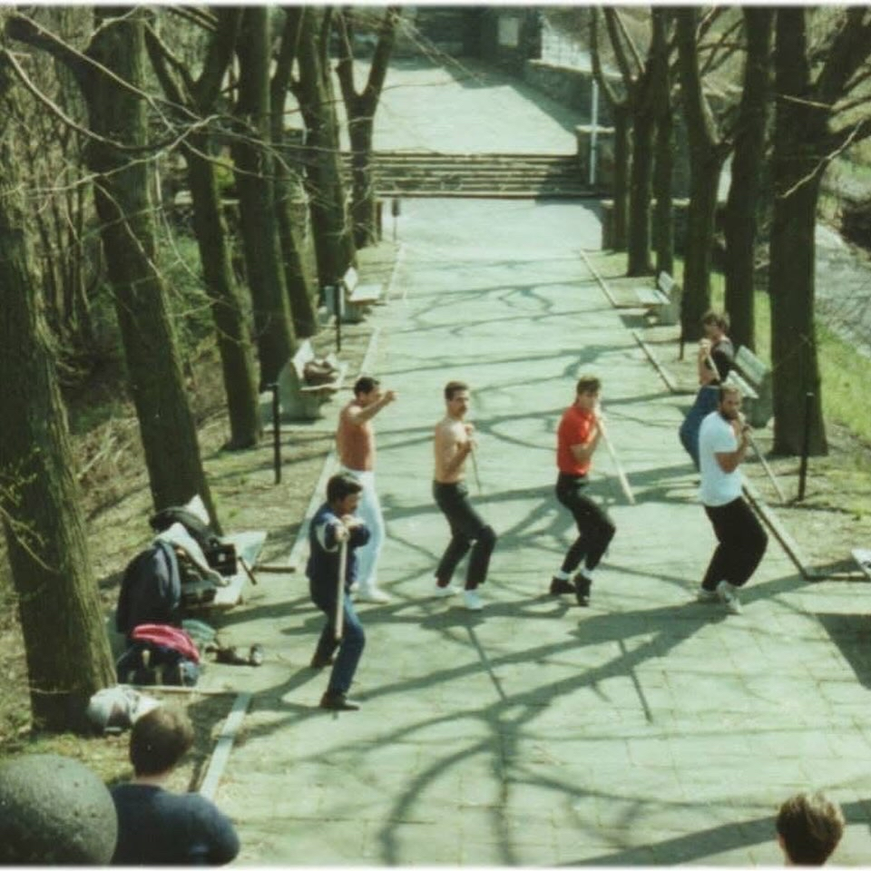
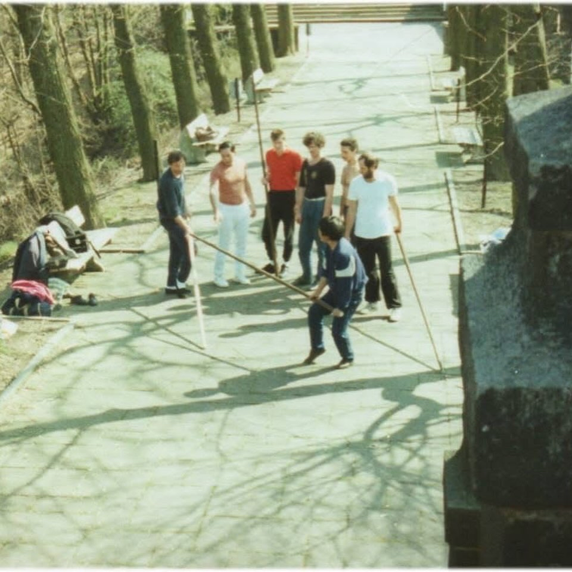

*By Philipp Bayer*

---

## 長棍該什麼時候教？

As I have noticed, there seem to be different opinions on when the Long Pole should be introduced or can be introduced. Some even think it is unnecessary altogether and in Nuremberg one is referred to western fencing. Others seem to know everything and claim that in Hong Kong it was taught towards the end of the student's development.

我注意到，關於長棍什麼時候該教、能不能教，大家似乎意見分歧。有些人甚至覺得根本沒必要學，在紐倫堡還有人叫大家去練西洋劍。另一些人則好像什麼都懂，聲稱在香港，長棍是學到最後才教的。

---

## 1986 年 — 黃淳樑師父的做法

When my teacher came to Germany for his second time in 1986, he taught some of my students the first steps in the Long Pole training, as evidenced in the picture. These were taken in May 1986 at the memorial in Altena-Westfalia. Most of them had trained under me for 1 or 2 years. I myself had only known Sifu Wong for three years!

1986 年，我師父第二次來德國時，就教了我一些學生長棍的基礎動作，照片可以為證。這些照片是 1986 年 5 月在 Altena-Westfalia 的紀念碑前拍的。他們大多才跟我練了一兩年，而我自己認識 Sifu Wong 也才三年而已！

### 為什麼這麼早教？

The reasons that he taught it this early were manyfold:

他這麼早教長棍，理由有很多：

> **First**, he thought that the pole was difficult to control and demanded a lot of practice over a long period of time to influence the development of Ving Tsun as a whole.

> **首先**，他認為長棍很難控制，需要長時間大量練習，才能對詠春整體發展產生影響。

> **Secondly**, most start the pole at the zenith of their performance ability, so that little time remains to reap the benefits of such training.

> **其次**，大多數人開始練棍的時候，體能已經過了巔峰，能享受練棍好處的時間所剩無幾。

---

## 趁虛而入 — 系統的根本

Being able to take advantage of an opening is fundamental in the system. If one is unable to do so, all the punching power and fighting spirit will be obsolete.

> 能抓住對手的破綻趁虛而入，是這套系統的根本。做不到這點，再大的拳威和鬥志都沒用。

---

## 長棍訓練的三大益處

### 一、啟動速度與步法

Long pole training, especially the low stance, contributes greatly to increased start speed and faster footwork.

長棍訓練，尤其是低馬步，對提升 **「啟動速度」** 和 **「步法靈活度」** 幫助極大。

### 二、整體發力（Unified Body Power）

Another important skill, developed through various pole exercises, is **power from the unified body**. Without this, punches are mechanical, deriving its power based on the diameter of the practitioner's arms.

透過各種棍法練習培養出的另一個重要技能，就是 **「整體發力」**。少了這個，出拳就會很機械化，力量完全取決於你手臂有多粗。

> Even somebody that has done "Arm Ving Tsun" for 15 years is going to look like a raw beginner when starting this exercise. Unfortunately, he now is 15 years older and his Ving Tsun has missed out on 15 years of essential influences.

> 哪怕一個人練了 15 年「手臂詠春（只靠手打拳）」，一開始練整體發力時，看起來也會像個完全的新手。遺憾的是，他現在已經老了 15 歲，他的詠春也錯過了 15 年的關鍵發展。

### 三、打擊精準度

Another important point is the fact that long pole training not only increases punching power, but also **punching precision**, meaning concentrating max force at a small area of impact.

長棍訓練不僅能增加出拳的 **「威力」**，還能提升打擊的 **「精準度」**，也就是能把最大的力量集中在一個微小的打擊面上。

> More about that later in my book which will include some of Wong Shun Leung's teachings on weaponry, some of them handwritten and translated.

> 這方面我之後會在我的書裡多寫一些，書中也會收錄黃淳樑關於兵器的教導，部分還包含他手稿的翻譯。



### 長棍訓練益處總覽

| 益處 | 說明 |
|------|------|
| **啟動速度** | 低馬步訓練增強腿部爆發力 |
| **步法靈活度** | 持棍移動強化步法穩定與靈活 |
| **整體發力** | 學會用全身而非單靠手臂出力 |
| **出拳威力** | 棍法力量轉化為拳法力量 |
| **打擊精準度** | 將最大力量集中於最小接觸面 |

---

## 天分與訓練時機

From my own experience I can say that there are some students which can handle the long pole correctly without any knowledge of even the Siu Lim Tao. There are also those who, after five years of hard training, can't do the same.

以我自己的經驗來說，有些學生連小念頭（Siu Lim Tao）都還不會，但已經能正確地掌握長棍；也有人苦練了五年還是做不到。

> Should the teacher therefore take the pole away from the more gifted person and postpone it for another 5 years?

> 那老師是不是應該把棍子從天分較高的學生手裡收走，叫他再等五年？

---

## 蠟筆的比喻

Who would take away the crayon of a child that has shown to intuitively excel at painting, just because it is too early for that?

Would one ban a third grader from school, just because he is at sixth grade skill level already, and even ahead of the others?

如果一個小孩天生畫畫就有直覺、表現出色，誰會只因為「時候未到」就沒收他的蠟筆？

如果一個三年級的學生程度已經到了六年級，甚至超越了其他人，難道就不讓他上學了嗎？

> **No!** If one had just a little bit of brains, one would increase their skills through additional demands.

> **當然不會！** 只要稍微有點腦子，就會透過更多的挑戰來提升他們的能力。

---

## 結語 — 趁年輕，趁還舉得動

In Kung Fu and especially in Ving Tsun, where a holistic bodily development is emphasised, it is majorly important to start in your early years to get a decent final result.

在功夫裡，尤其是強調 **「身體全面發展」** 的詠春，趁年輕早點開始練，對最終成果來說非常重要。

> But if this development is blocked, postponed or thwarted at all, it is questionable that any result be achieved by the probably by now "turned grey" senior student, who might not be able to even lift the pole anymore.

> 如果這個發展被阻擋、延後或打斷，那些可能已經「頭髮花白」的資深學生還能不能練出成果就很難說了—— **「到那時候他們可能連棍子都舉不起來了」**。

---

### 核心觀點摘要

| 觀點 | 說明 |
|------|------|
| **傳統做法** | 棍法留到最後才教 |
| **黃淳樑的做法** | 盡早引入，長期受益 |
| **問題所在** | 等到體能過了巔峰才學，為時已晚 |
| **天分因素** | 因材施教，有天分的學生應提前學習 |
| **最終結論** | 趁年輕開始，才能獲得完整的發展 |

---

*文章作者：Philipp Bayer*