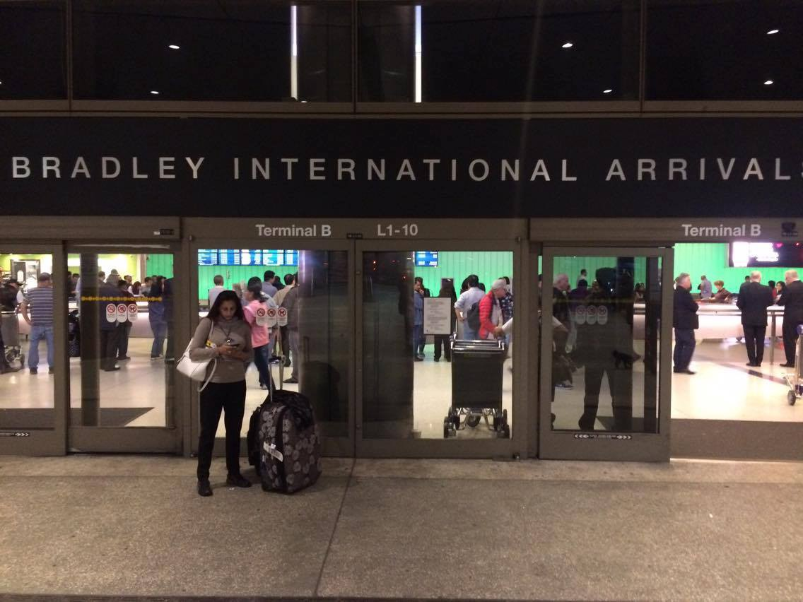
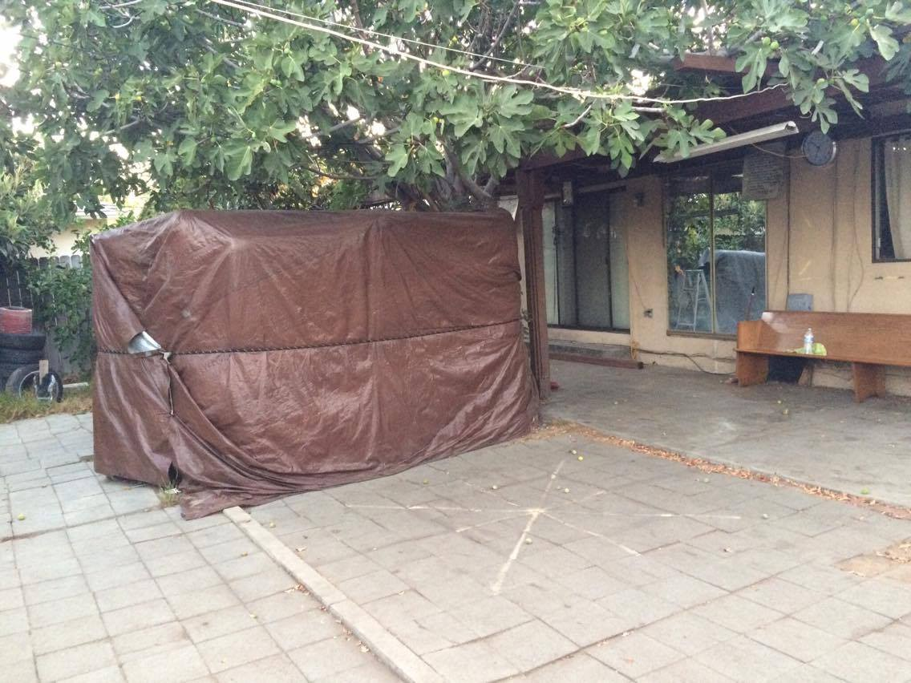
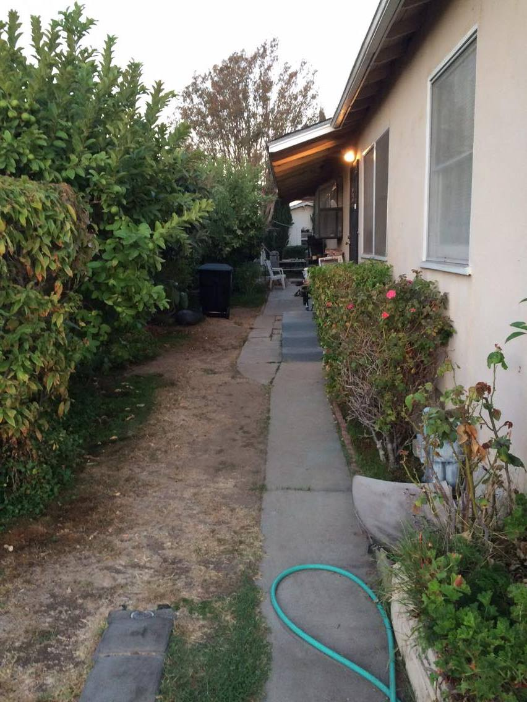

## 前言 — 一個瘋狂的決定

我想今年做的最瘋狂的事情，就屬這件事了。

年中就決定要執行，過一個月後馬上就去買機票。心中總有個聲音，**今年不去就沒機會了**，隨著年紀增長，事情只會越來越多。算了算今年的假期，就全部梭哈了，完成學生時代想完成的夢想。

真正到出發前還有個小插曲，沒想到出差是安排在去洛杉磯之前，回國後三天後，就得馬上搭飛機前往洛杉磯。原本以為體力上還好，結果實際上根本體力透支，下次記得要注意行程上的安排與交換。

---

## 抵達洛杉磯

搭上了 EVA AIR，歷經 12.5 小時的坐立難安，終於抵達了洛杉磯國際機場（LAX）。而台灣旅客到的 Terminal，就是 Tom Bradley International Terminal，也就是俗稱的 Terminal B。

出來後馬上利用手機聯絡 Gary Lam，師公表示我太早到了，需要請我在機場等一下。後來才知道，原來拳館還沒有關門，原訂計畫是關門後順道來機場接我。

師公請我在機場內稍等一會，他現在要開車過來，大約要一個多小時，還特別囑咐我可以先買個三明治吃吃，別餓著了。

找了個角落，我坐在行李箱上划著手機等著，忽然師公打電話過來說可以出來了。而遠遠的看到一台超大 Honda 箱型車，車窗搖下來就是師公本人，非常熱情的向我招手。我也趕緊上前，畢竟 LAX 這邊不太能久停，大家也是一直被警察驅趕。

上了車才發現，原來是師奶駕車，太令我驚訝了。一路上師公與師奶頻頻問我一路上都還好嗎？有吃東西嗎？也大致跟我介紹 LA 的環境。不過當開始講廣東話的時候，我自己就聽不太懂了。

---

## 入住 Monterey Park

我們就這樣一路回到了 Monterey Park，也就是師公的家。當天已經是晚上 11 點 30 分了，其實身體已經非常的疲累。

師公交代給我一些日用品位置與衛浴設備的使用方式，就將鑰匙交給了我。離開門前，師公還給我兩根香蕉與兩瓶水。

第一週蠻幸運的，小房間沒有其他的國際學生，只有我一個人，頓時覺得還蠻清幽的。環顧了一下宿舍，裡面最多可以睡到五位學生。

### 宿舍設施

- 一台老舊的 DVD 撥放器（可惜遙控器壞了，只能撥放與停止）
- CRT 電視
- 架上有目前所有師公所出的 DVD

住宿期間，每一位國際學生都可以自由地觀看 DVD。師公的理念是希望學生邊看 DVD 複習觀念與動作，若有不懂的地方，就可以直接在課堂上提出問題與癥結的點。

> 我覺得有出 DVD 不只是可以讓學生複習，也是一種招生的方式，讓世界各地的學生看到這個系統的運作與實際表現。這是需要有高度的自信與絕佳的身法結構，才有辦法這樣做，不然等同自曝其短達到反效果。

快速的洗完澡後，馬上整理一下就準備就寢了。也許是因為身體太過勞累，很快的我就入睡了。

---

## 初見後院 — The Backyard

隔天起了個大早，約六七點我就起來了，開了房門，映入眼簾的是世界知名的訓練場地 — **後院（The Backyard）**。

LA 早上的氣溫非常的涼，大約只有十幾度出頭。不過因為這邊空氣濕度不高，體感的溫度也不會到非常的不舒服。習慣後反而有種爽快感。

實際走到各個角落，發現其實後院的面積並不大，以前在台灣看照片會認知應該是個大場地。

### 訓練設備

- **床墊** — 最外層是尼龍布，另一側是兩邊都有床墊，可以供雙人使用，就不用對方練個幾次還得雙方互換再練，非常方便
- **木人樁** — 都改為塑膠（PVC）材質，我猜是因為在外風吹日曬，換成塑膠會比較耐用，但樁手樁腳還是維持木頭材質

整體打起來的感覺還行，不過我自己還是認為摸木頭會比較有紮實感，尤其在做 Po Pai 掌時，感覺就更明顯。

---

## 第一位室友

早上集合時間是八點鐘，打開外門準備進入客廳時，忽然有個外國人對我說早安。後來才知道，他也是國際學生，來自華盛頓，是我的第一位室友。

但他當初是預定私人房間，所以是跟師公一起住。不過，因為是私人房間，價格上也比通鋪每天多 10 美元。

後來我們聊了一下才知道，今年他已經 57 歲了，已退休。算是年紀較大的學員，不過我們聊起詠春，就像兩個小男孩一樣充滿了好奇。

---

## 師公客廳的歷史

師公的客廳牆上掛了許多過往的歷史，有黃淳樑太師公的書法筆跡，上面寫著 **「掌相精研」**。後來問師公才知道，他有幫人看風水、面相與掌相等等。

我還特別問師公說，外國人會相信這個嗎？師公說，其實一直都有外國人來找他做這方面的諮詢，想想還是挺有趣的。

### 珍貴的證書

其中令我停下腳步駐足觀看的是這兩張證書，都是由太師公所頒發的：

1. **教練證明** — 當年在香港開館的教練證明，上面可以清楚看到地址、姓名與有效期限
2. **永久會員證明** — 香港詠春體育會永久會員的證明書，上面有太師公的簽名，非常珍貴

> 其實如果現在要拿永久會員的證明書，只要付錢就可以了，但師公上面有太師公的簽名，非常珍貴。

這兩張證書像是帶我回到了 1985 年的香港，那個學武興盛的年代。可惜證書年代久遠，有點褪色了，但也等同是時間的烙印。

---

## 日常生活 — 早餐時光

集合後，師公會載我們去吃早餐。而早餐每天去的地方都一樣，就是 **JJ's Cafe** — 一家港式飲茶。

### 早餐選擇

- 通心粉
- 腸粉
- 廣東粥
- 牛排類

一餐大概 10 塊上下。通常師公會先買份報紙，而到餐廳內就會發現到大家都講廣東話，蠻有趣的。

飲料可以選擇咖啡或奶茶，好處是可以不斷地續杯。但我覺得與台灣不同的地方是，飲料送來會配一罐煉乳，不論是咖啡或奶茶，師公都會加入三到四圈的煉乳。

> 據說這樣風味會提升許多，我後來也有嘗試加入，也不錯。

排餐類我覺得最好吃的是牛排，腸粉也不錯，但必須加點廣東粥做套餐。

---

## 每日訓練時程

師公跟我說明目前開館的時間：

| 日期 | 後院 | 拳館 |
|------|------|------|
| 星期一 | ✅ | ✅ |
| 星期二 | ✅ | ✅ |
| 星期三 | ✅ | ✅ |
| 星期四 | ✅ | ✅ |
| 星期五 | ✅ | ❌ |
| 星期六 | ❌ | ✅ |
| 星期日 | ❌ | ✅ |

> 其實可以發現到，**師公沒有休息日**，每天都有學生要訓練。我覺得算是蠻忙的，不過還好通常都只有 3～4 小時而已，後面就可以休息。

### 一天的流程

| 時段 | 活動 |
|------|------|
| **早上 8:00** | 集合，前往 JJ's Cafe 吃早餐 |
| **早上** | 回到後院訓練，師公在旁邊澆花與摘水果給學生吃 |
| **中午** | 學生自由活動，附近吃飯 |
| **下午** | 師公到客廳休息，學生休息或觀看 DVD |
| **下午 4:30** | 再次集合，前往拳館訓練 |

午餐附近有墨西哥餐廳、日式料理與港式雞粉。我就靠了這三家撐過了十幾天的午餐，其實都還蠻好吃的，不至於會吃得太膩。

---

## 拳館訓練

拳館相較於後院，真的大得非常多，器具也相當齊全。

國際學生要幫忙師公開門與整理環境，我這邊會幫忙使用靜電拖把拖地，保持地板的乾淨，避免其他師兄弟腳步踩到髒污而打滑受傷。

### 形形色色的學生

在這邊，有各式各樣的學生：

- 有的是**老闆**
- 有的是**電影評論家**
- 也有在美國**鼎泰豐**工作的人

> 一聽到我是台灣過來的，顯得格外親切，頻頻與我詢問台灣鼎泰豐的狀況，真是有趣。

### 師公的教學方式

這幾天待在拳館的日子，發現有很多人會詢問課程：

- **有經驗且客氣的** — 師公就會下場跟他試手
- **完全沒有經驗的** — 說明完課程後，交由國際學生教導基本套路，當師公覺得差不多後，就會接手接著說明拳理

後面我觀察到，師公教學經驗豐富，當他起來巡視看的時候，**大概只要觀察學生五秒，就會知道哪邊不好或者可以繼續下一個訓練**。這點真的讓我感到驚奇。

### 最精華的時刻

學生們也非常歡迎去問他問題，我最喜歡的時刻就是這個，因為師公會開始隨機講某個拳理，所有其他在旁訓練的學生，都可以自由地停下來聽師公展示。

> 人越多，師公會越講越多，這時候是最精華的時刻。

教學經驗豐富的師公，會依據當下學生問的盲點，做大量的延伸與細部的講解。當這個時刻發生，師公下場就是 Gary Lam，不再是遙不可及的神話，**打給你看最真實**。

---

## 結語 — 帶著滿滿的筆記回家

回顧這十幾天的訓練，得到了世界級的大師教導，時間很短，能夠吸收馬上實踐的並不多。

但師公送我去機場前問我：

> 「有把這次來教的東西都記下來了嗎？」

我回答：「都記下來了。」

師公給了我一個微笑。隨後說到：

> 「我知道你們每個國際學生能來都不容易，都犧牲很多東西，所以我都盡量把東西全部交給你們，讓你們回去自己練習。」

看著手上滿滿的筆記，我知道我得加油，盼望有一天可以再次前來，像個小男孩一樣，蹦蹦跳跳的經過後院小徑。

**祝福師公館運昌隆，身體健康。**

---

*撰寫日期：2017 年 11 月 5 日*
*最後更新：2026 年 7 月 2 日*