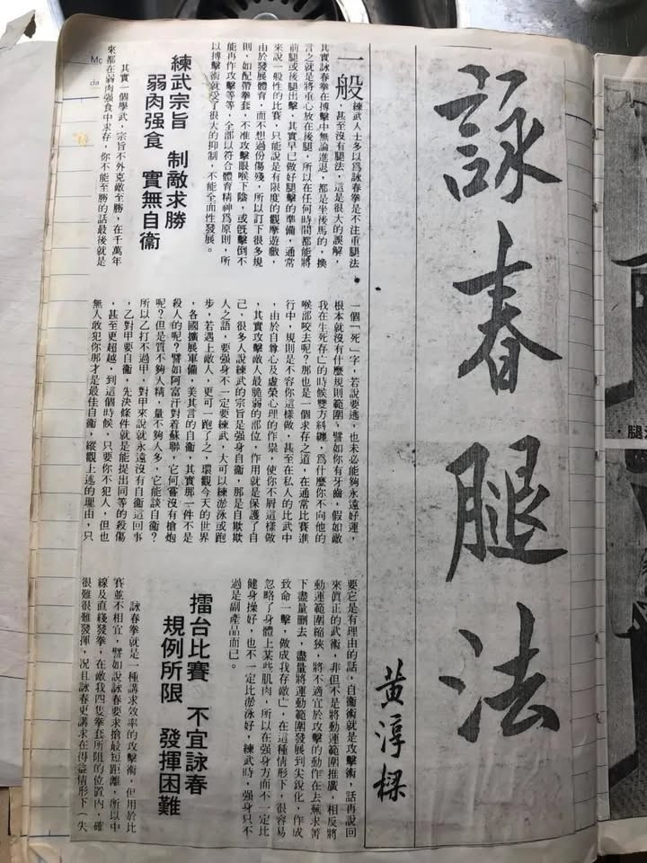
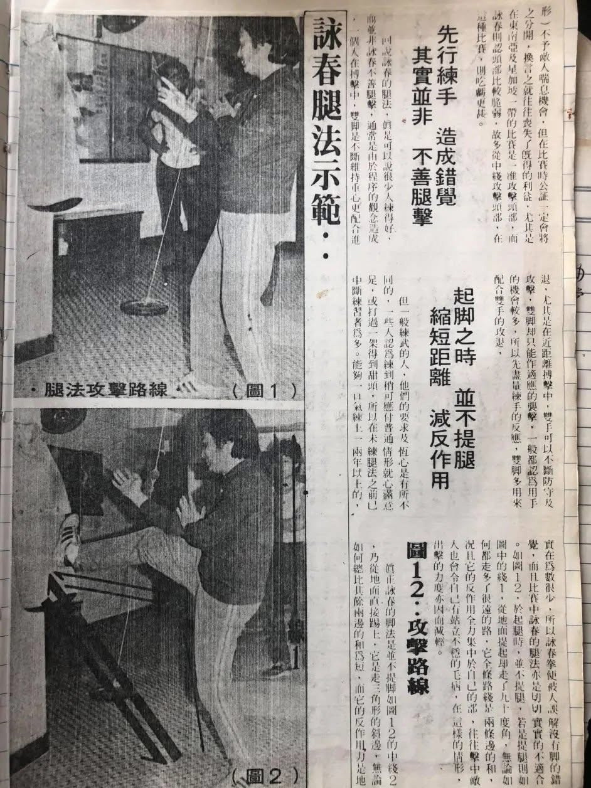
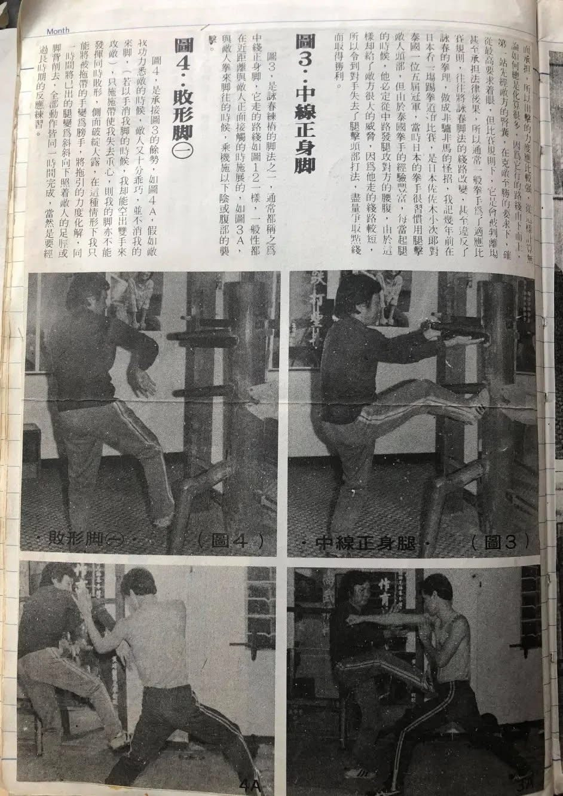
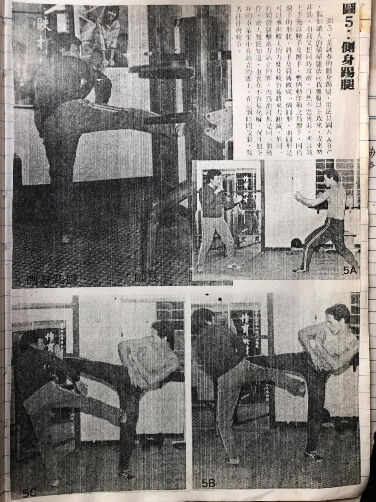
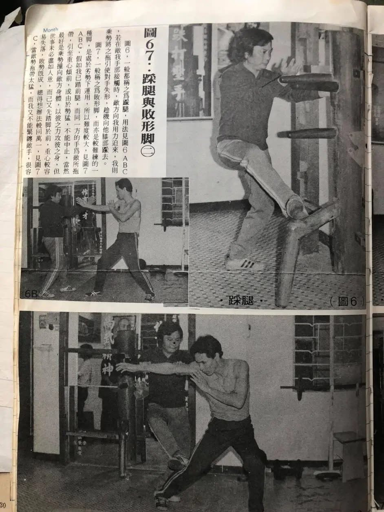
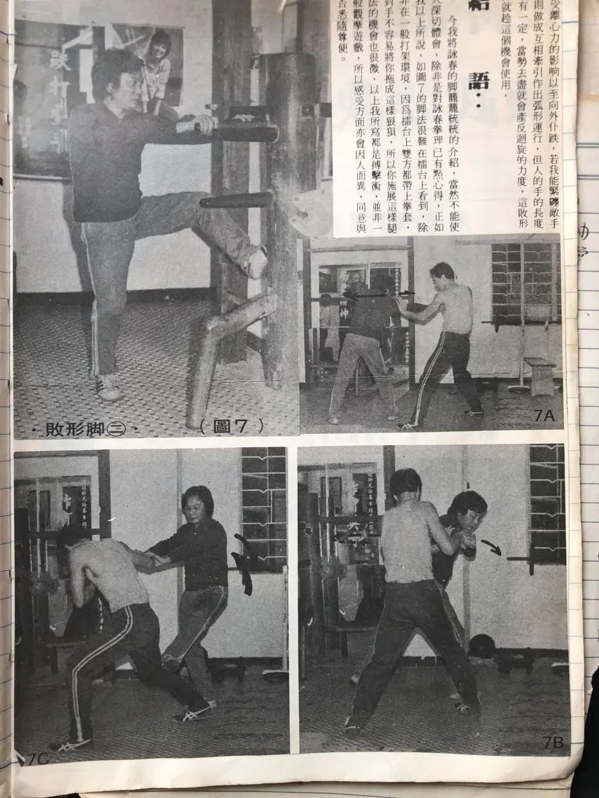

## 詠春腿法

一般練武人士多以為詠春拳是不注重腿法，甚至沒有腿法，這是很大的誤解。其實詠春拳在搏擊中無論進退，都是坐後馬的，換言之就是將重心放在後腿。所以在任何時間都能將前腿或後腿出擊，其實早已做好腿擊的準備。

通常來說一般性的比賽，只能說是有限度的觀摩遊戲，由於發展體育，而不想過份傷殘，所以訂下很多規則，如配戴拳套、不准攻擊眼喉下陰、或者擊倒不能再作攻擊等等；全部以符合體育精神為原則，所以搏擊術就受了很大的限制，不能全面性發展。

---

## 練武宗旨 — 制敵求勝

其實一個人學武，宗旨不外克敵致勝。在千萬年來都在弱肉強食中求存，你不能致勝的話最後就是一個「死」字。若說要逃，也未必能夠永遠好運，根本就沒有什麼規則範圍。

譬如你有牙齒，假如敵我在生死存亡的時候雙方糾纏，為什麼你不向他的喉部咬去呢？那也是一個求存之道。在通常比賽進行中，規則是不容你這樣做，甚至在私人的比武中，由於自尊心及虛榮心的作祟，使你不屑這樣做。

> 其實攻擊敵人最脆弱的部位，作用就是保護了自己。

很多人說練武的宗旨是強身自衛，那是自欺欺人之語。要強身不一定要練武，大可以練游泳或跑步；若遇上敵人，更可一跑了之。

環觀今天的世界，各國擴展軍備，美其言的自衛，甚實哪一件不是殺人的呢？譬如阿富汗對著蘇聯，它何嘗沒有槍炮呢？但是質不夠人精，量不夠人多，它能談自衛？

所以乙打不過甲，對甲來說就沒有自衛這回事。乙對甲要自衛，先決條件就是能提出同等的殺傷力，甚至更超越。到這個時候，只要你不犯人，但也無人敢犯你才是最佳自衛！

> 縱觀上述的理由，只要它是有理的話，**自衛術就是攻擊術**。

---

## 真正的武術

話再說回來，真正的武術，非但不是將運動範圍推廣，相反卻是將運動範圍縮狹，將不適宜於攻擊的動作在去蕪存菁下盡量刪去，盡量將運動範圍發展到尖銳化，作成致命一擊，做成我存敵亡。

在這種情形下，很容易忽略了身體某些肌肉，所以在強身方面不一定比體操好，也不一定比游泳好。

> 練武時，強身只不過是副產品而已。

---

## 擂台比賽 — 不宜詠春

詠春拳就是一種講求效率的攻擊術，但用於比賽並不相宜。

### 為何不適合比賽？

| 原因 | 說明 |
|------|------|
| **拳套阻礙** | 詠春要求搶最短距離，中線及直線發拳，在敵我四隻拳套所阻的位置內，確很難發揮 |
| **規則限制** | 詠春講求在得益情形下不予敵人喘息機會，但比賽時公證一定會將之分開 |
| **禁擊頭部** | 東南亞及新加坡的比賽不准攻擊頭部，而詠春認為頭部比較脆弱，多從中線攻擊頭部 |

在這種比賽規則下，詠春拳吃虧更甚。

---

## 先行練手 — 造成錯覺

回說詠春的腿法，真是很少人可以練得好，而並非詠春不擅腿擊，通常是由於程序的觀念做成。

一個人在搏擊中，雙腳是不斷維持重心更配合進退。尤其是在近距離搏擊中：

- **雙手** — 可以不斷防守及攻擊
- **雙腳** — 只能作適應的襲擊

一般都認為用手的機會較多，所以先盡量練手的反應，雙腳多用來配合雙手的攻退。

但一般練武的人，他們的要求及恆心是有所不同的。一些人為練到稍可應付普通情形就心滿意足，或打過一架得到甜頭，所以在未練腿法之前就中斷練習者為多。

> 能夠一口氣練上一兩年以上的，實在為數很少，所以詠春拳便被人誤解沒有腳的錯覺。

---

## 起腳之時 — 並不提腿

### 一般腿法的問題

若是提腿，從地面提起卻走了九十度角，無論如何都走多了很遠的路，全條路線是兩條邊的和。況且它的反作用力全集中於自己的腳部，往往擊中敵人也會令自己有站不穩的毛病。在這樣的情形下，出擊的力度亦因而減輕。

### 真正的詠春腳法

真正的詠春腳法是並不提腳，乃從地面直接踢上，它是走三角形的斜邊。

| 比較 | 一般腿法 | 詠春腿法 |
|------|----------|----------|
| **路線** | 兩條邊的和（較長） | 三角形斜邊（較短） |
| **反作用力** | 集中在自己腳部 | 由地面承擔 |
| **力度** | 較弱 | 較強 |
| **穩定性** | 容易站不穩 | 較為穩定 |

> 從這樣計算無論如何總是化算很多，因為它行的路線由下而上，第一站先經敵方的腎囊，在克敵致勝的要求下，確從最高要求著眼。

但在比賽規則下，它是會被判離場甚至承擔法律後果，所以一般拳手為了適應比賽規則，往往將詠春腳法的線路改變，甚至違反了詠春的拳理，做成非驢非馬的怪招。

### 實例

我記得幾年前在日本看一場踢拳道的比賽，是日本佐佐木小次郎對泰國一位五屆冠軍。當時日本的拳手很習慣用腿擊敵人頭部，但由於泰國拳手的經驗豐富，每當起腿的時候，他必定從中路發腿攻擊對方的腰腹，由於這樣卻給了敵方很大的威脅。因為他走的路線較短，所以令對手失去了腿擊頭部的打法，盡量爭取點數而取得勝利。

---

## 詠春腿法詳解

### 一、中線正身腳

通常都稱之為中線正身腳，一般性都在近距離與敵人正面接觸的時候施展的。與敵人拳來腳往的時候，乘機施以下陰或腹部的襲擊。

### 二、敗形腳（一）

承接中線正身腳的餘勢。假如敵我功力悉敵的時候，敵人十分乖巧，並不消我的來腳（若以手消來腳的話，我卻能空出雙手攻敵），只施拖帶使我失去重心，則我的腳亦不能發揮同時敗形，側面破綻大露。

在這種情形下：
1. 將被拖帶的手變為**膀手**
2. 將拖引的力度化解
3. 同一時間將已出的腿變為斜斜向下照著敵人的**足脛**或**背部**削去
4. 全部動作皆**同一時間完成**

> 這當然是要經過長時期的反應練習。

### 三、側身踢腿

假如敵人的橫掃腿法向我腰腹以上攻來，或來勢甚勁，而我又想同時攻敵，自然不思後退。

**應對方法：**
- 上手施以膀手及攤手，整個動作稱之為「**滾手**」
- 滾手的形狀將手及肩膊做成一個**圓形**
- 圓形可承擔較大的力度及較容易將來力卸減
- 同時發腿攻擊敵方**站立的腳**

> 因為消打都是一個動作，敵人難以知道，也實在不容易化解；況且他全身的重量集中在站立的腳上，在這個時間受襲，傷害往往會較重。

### 四、踩腿

若在敵我手部接觸時，敵方向我用力迫來，我則乘勢將之拖引使對手失形，趁機向他**膝部**踩去。

### 五、敗形腳（二）

亦是較難練的一種腳，是處於**劣勢下**運用，所以難度較大。

假如我已踏前腿，而同一方的手為敵所拖帶，引致重心傾前，或由於勢猛，不能中止：

- **最佳情況：** 乘勢撞向敵方身體，以彼之力攻彼之身
- **劣勢情況：** 己又先踏腳於前，重心較容易失落，敗勢既成，總得想辦法挽回萬一

當敵勢拖帶太猛，而我又不能緊纏敵手，很容易受離心力的影響而向外仆跌。但若我能緊纏敵手，則做成互相牽引作出弧形運行，但人的手的長度是有一定，當勢去盡就會產生反迴旋的力度，這**敗形腳**就趁這個機會使用。

---

## 結語

今我將詠春的腳籠籠統統的介紹，當然不能使人深切體會，除非是對詠春拳理已有點心得。

正如我以上所說，如敗形腳的腳法很難在擂台上看到，除非在一般打架環境。因為擂台上雙方都戴上拳套，對手不容易將你拖成這樣狼狽，所以你施展這樣的腿法的機會也很微。

> 以上我所寫的都是**搏擊術**，並非一般觀摩遊戲，所以感受方面亦會因人而異，同意與否悉隨尊便。

---

## 詠春腿法總結

| 腿法 | 使用時機 | 攻擊目標 |
|------|----------|----------|
| **中線正身腳** | 近距離正面接觸 | 下陰、腹部 |
| **敗形腳（一）** | 被拖帶失形時 | 足脛、背部 |
| **側身踢腿** | 敵人橫掃腿攻來時 | 敵方站立的腳 |
| **踩腿** | 手部接觸敵方用力迫來時 | 膝部 |
| **敗形腳（二）** | 劣勢下重心傾前時 | 趁反迴旋力使用 |

### 詠春腿法核心原則

1. **不提腿** — 從地面直接踢上，走最短路線
2. **坐後馬** — 重心放在後腿，隨時準備出擊
3. **消打同時** — 防守與攻擊在同一動作完成
4. **攻擊要害** — 以最高效率克敵致勝

---

*文章作者：黃淳樑師傅*
*黃淳樑（1935-1997），葉問宗師得意門生，人稱「講手王」，一生致力於詠春拳的實戰研究與推廣。*